<p align="center">
  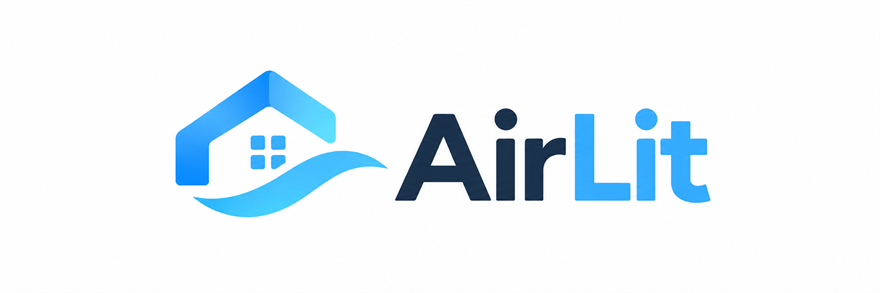
</p>

<p align="center">
  <strong>Nature Remo 非公式デスクトップクライアント</strong>
</p>

<p align="center">
  Nature Remo で家電を操作するための Windows アプリです。<br>
  エアコン・照明・テレビ・赤外線機器・スマートメーターに対応し、<br>
  シーンとオートメーションをデスクトップから扱えます。
</p>

> [!NOTE]
> 個人が開発した非公式アプリです。Nature 株式会社とは関係がなく、同社による承認も受けていません。
> 「Nature Remo」は Nature 株式会社の商標です。

<br>

<p align="center">
  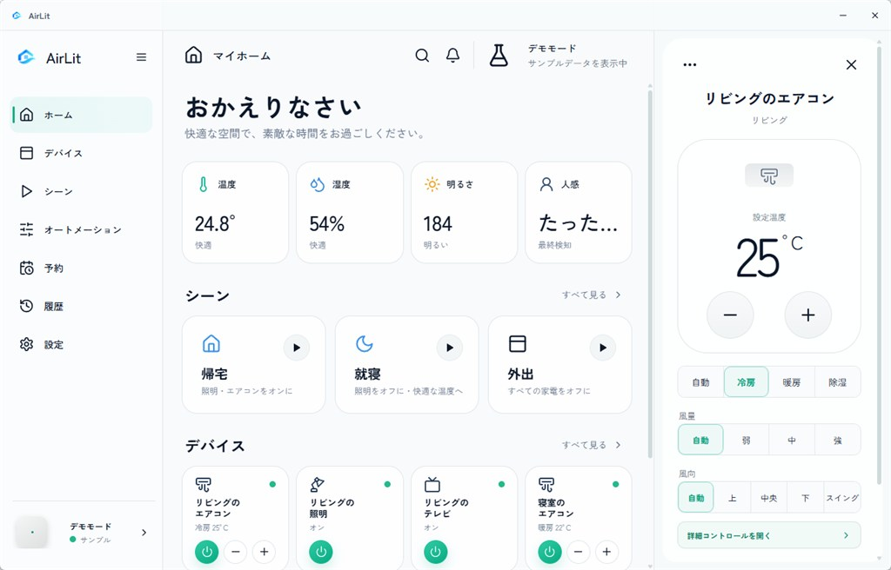
</p>

<br>

## インストール

[Releases](../../releases) から `AirLit_x.y.z_x64-setup.exe` をダウンロードして実行してください。

Windows 11 ではそのまま動作します。Windows 10 で WebView2 が入っていない場合は、
インストーラが自動で取得します。

> 署名証明書を付けていないため、初回起動時に SmartScreen の警告が出ます。
> 「詳細情報」→「実行」で起動できます。

## 使い方

初回起動時は未接続の状態です。**設定 → アカウント → 接続する**、または画面右上の「未接続」から
アクセストークンを入力してください。

トークンは [home.nature.global](https://home.nature.global/) で発行できます。

<br>

## 画面と機能

> 以下のスクリーンショットは、アプリ内蔵のデモモード（サンプルデータ）で撮影したものです。

### ホーム

<p align="center"></p>

Remo 本体のセンサーが測った**温度・湿度・明るさ・人感**を上段に並べ、その下にシーンと家電が続きます。
センサーは機種によって持っているものが違うため、**実際に値が取れたものだけ**を表示します
（Remo mini なら温度だけ、Remo E なら1枚も出ません）。

右側のパネルでは、選んだ家電をそのまま操作できます。エアコンなら設定温度・運転モード・風量・風向を、
その機種が対応している選択肢だけ並べます。

### デバイス

<p align="center">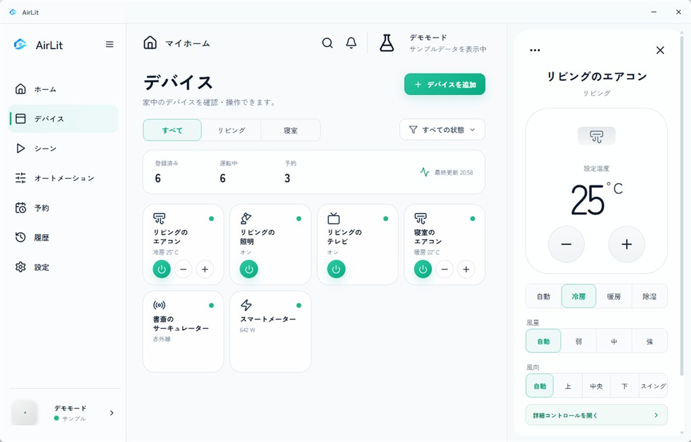</p>

登録済みの家電を部屋と運転状態で絞り込めます。上部の集計は**取得できた値だけ**を出しています
（Cloud API は家電ごとのオンライン状態を返さないため、「オフライン◯件」のような表示はしません）。

カードからは電源と温度をその場で変えられます。操作はまとめて送られ、± を連打しても
リクエストを浪費しません。

### エアコン

<p align="center">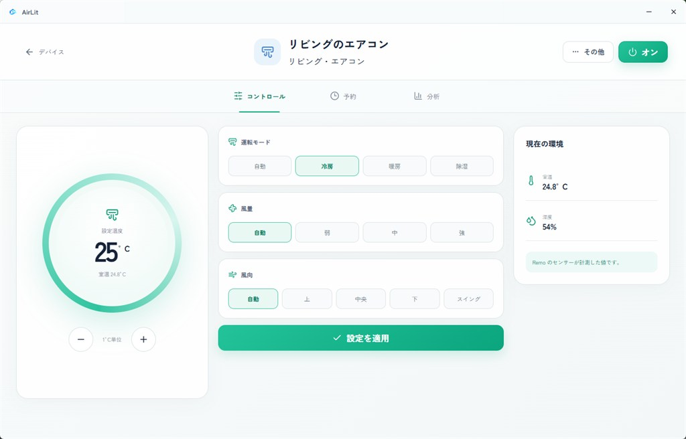</p>

運転モード・風量・風向は、**その機種が実際に対応している値**だけを Cloud API から読み取って並べます。
右側の「現在の環境」は Remo のセンサーの実測値です。

### テレビ・照明のリモコン

<p align="center">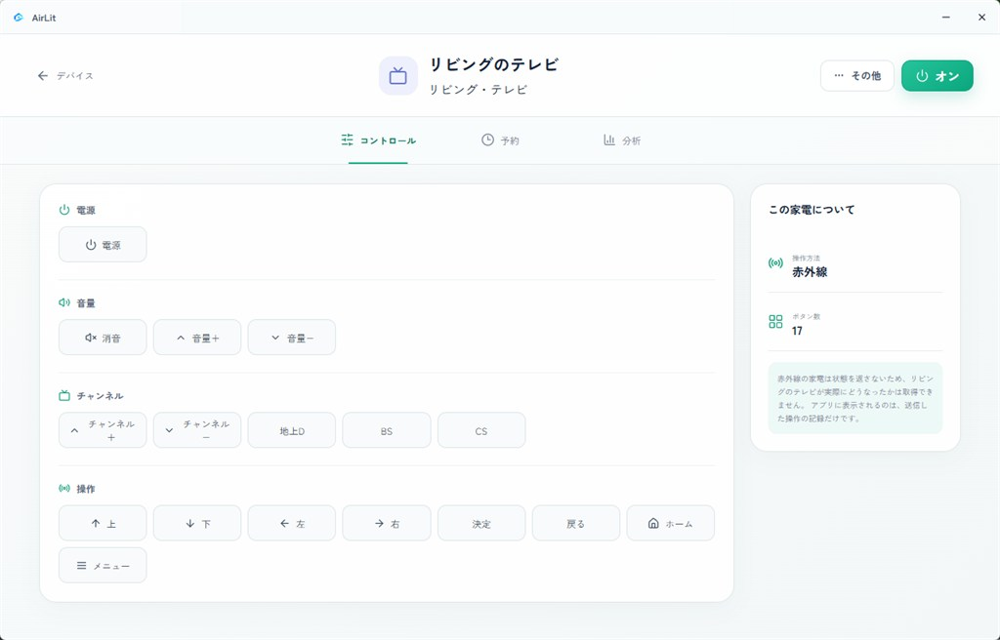</p>

Nature Remo が認識している家電では、**その家電が持っているボタンそのもの**を取り込んで並べます。
電源・音量・チャンネル・十字キーといった具合に自動で分類され、対応していないボタンは出てきません。

赤外線の家電は状態を返さないため、アプリは「送った操作」以上のことを表示しません。
実際にテレビがどのチャンネルになったかは、アプリからは分からないためです。

### シーン

<p align="center">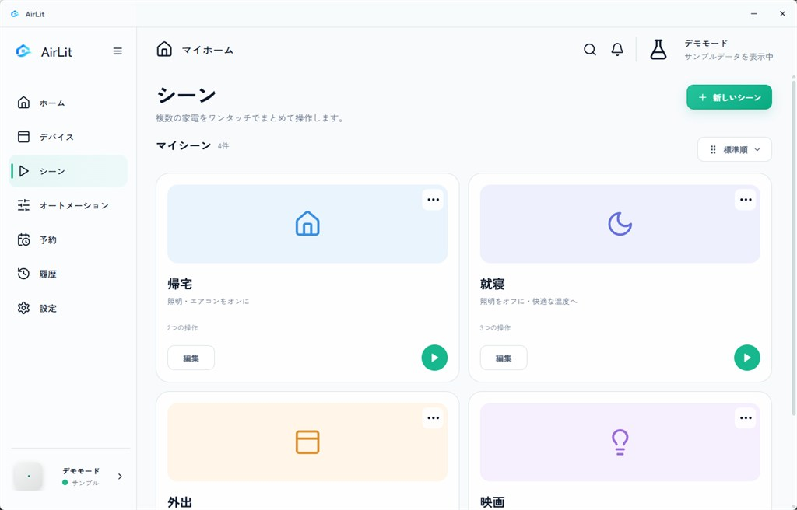</p>

複数の家電への操作をひとまとめにして、ワンタッチで実行します。
家電ごとに「エアコンは冷房25°C、照明はオフ、テレビは電源ボタンを送信」のように、
別々のコマンドを組み合わせられます。

### オートメーション

<p align="center">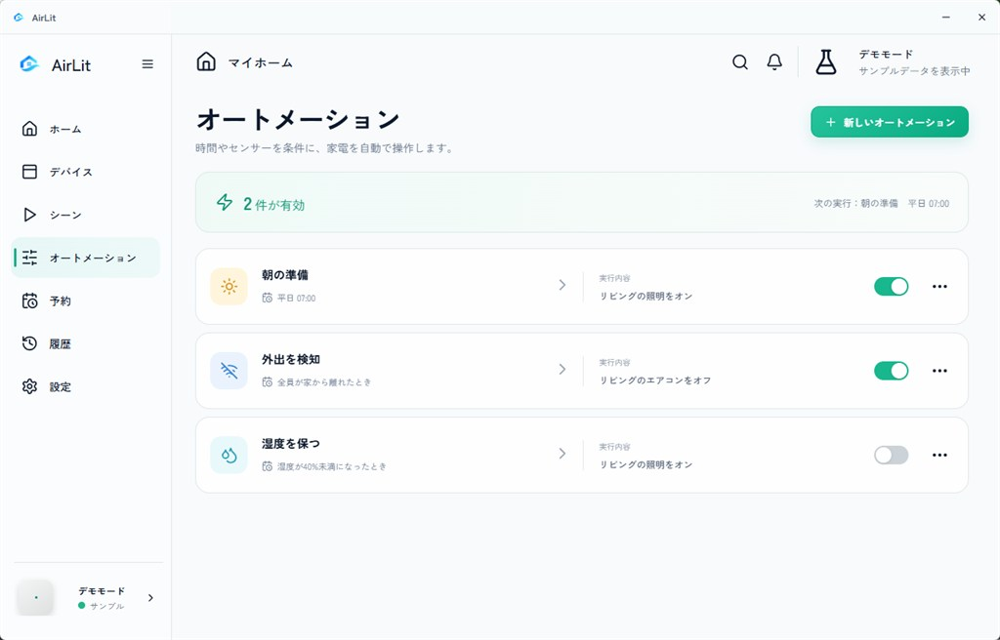</p>

時刻（毎日／平日／週末）をきっかけに家電を自動で操作します。
一度過ぎた時刻に遡って実行することはなく、同じ時刻で二重に実行することもありません。

### 予約

<p align="center">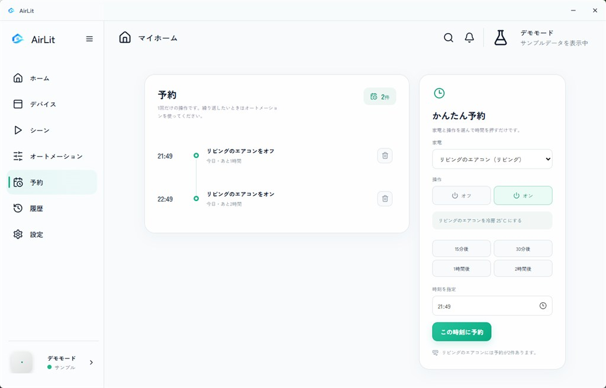</p>

オートメーションの**単発版**です。家電と操作を選んで「30分後」を押せば、それだけで登録できます。
時刻を指定することもでき、過ぎている時刻なら翌日として扱います。

実行できるのはアプリが起動している間だけです。起動していない間に時刻が過ぎた予約は、
**遡って実行せず**「実行できませんでした」として履歴に残します。

### 履歴

<p align="center">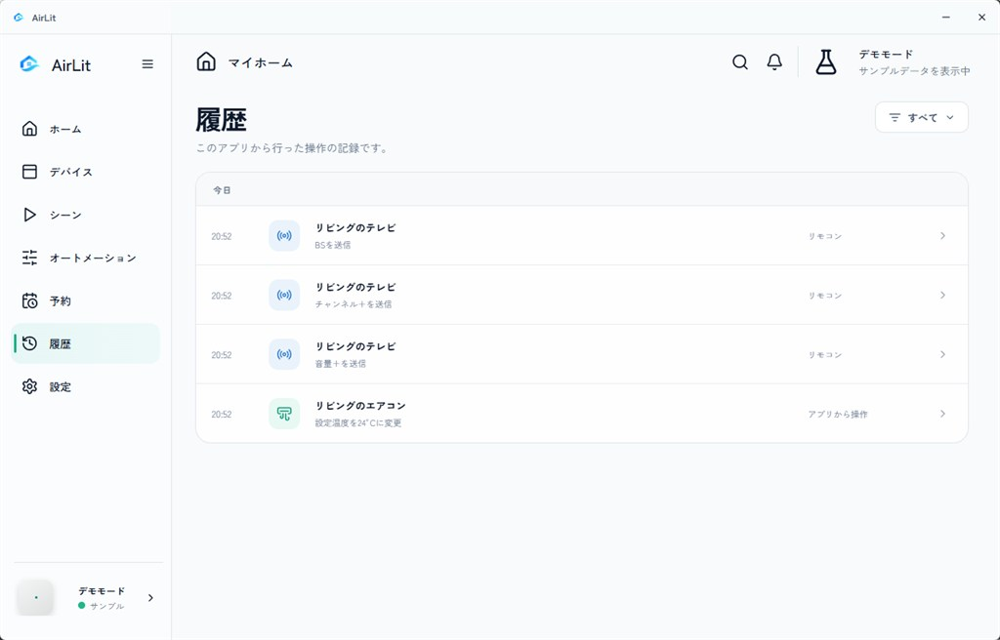</p>

Cloud API は操作履歴を返しません。そのためここに出るのは、**このアプリが実際に送った操作だけ**です。
他のアプリやリモコンからの操作は含まれません。

### ミニコントローラー

<p align="center">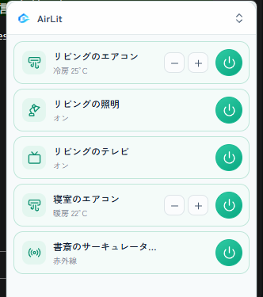</p>

ウィンドウを最小化すると、最前面に小さなコントローラーが残ります。
作業中でも照明やエアコンをすぐに切り替えられます。表示中はこちらだけが通信し、
メインウィンドウとで二重にリクエストを使うことはありません。

### ダークテーマ

<p align="center">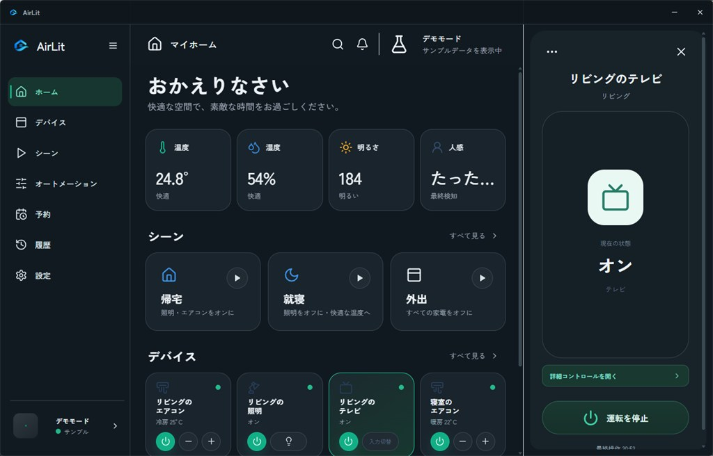</p>

**設定 → 外観**から、システム設定に追従／ライト／ダークを選べます。
動きを控えめにする「モーションを減らす」と、情報密度を上げる「コンパクト表示」も同じ画面にあります。

<br>

## 開発

### 必要な環境

| | |
|---|---|
| Node.js | 18 以上 |
| Rust | stable（MSVC ツールチェーン） |
| C++ ビルドツール | Visual Studio の「C++ によるデスクトップ開発」 |
| WebView2 | Windows 11 は標準搭載 |

### コマンド

```bash
npm install

npm run dev             # ブラウザで UI だけ確認
npm run desktop:dev     # デスクトップアプリとして起動
npm run desktop:build   # インストーラを生成（NSIS）
npm test                # Cloud API のマッピングと通信層を検証
```

`npm run dev` はブラウザ上でも動きます。その場合デスクトップ固有の機能
（トレイ・自動起動・OS通知）は無効になり、トークンは localStorage に保存されます。

### 実アカウントでの動作確認

`npm test` は実際の API レスポンス形式を模したデータで通信層を検証します
（機器の種別判定、設定値の読み書き、401 / 429 / 通信断の扱い、残量ヘッダの解釈）。
トークンなしで実行でき、実機には一切触れません。

実アカウントで試す場合は次の点に注意してください。

- **操作は本物の家電に届きます。** 電源トグルやシーン実行は実際にエアコンや照明を動かします
- **予算は5分あたり30リクエストです。** 起動中は約60秒ごとに2リクエスト（機器一覧＋センサー）を
  消費するため、表示したままだと5分で約10リクエストになります。残量はヘッダーに表示されます
- ウィンドウをトレイに格納している間はポーリングを停止するので、予算を消費しません

<br>

## 構成

```
src/
  api/              Cloud API の通信層
    types.ts          API のワイヤ型（Appliance / AirConSettings / Signal など）
    labels.ts         API の値 → 日本語ラベル（表示文字列はここだけ）
    rateLimiter.ts    5分30回の予算管理・直列化・429バックオフ
    client.ts         fetch ラッパー（認証・エラー分類・ヘッダ解釈）
  data/
    adapter.ts        RemoAdapter（MockAdapter / CloudAdapter）
    useRemo.ts        状態・ポーリング・楽観的更新・ロールバック
    session.ts        トークン保管（Tauri store / localStorage）
    library.ts        シーン・オートメーションの保存と発火判定
    useLibrary.ts     ライブラリの状態とスケジューラ
    history.ts        使用状況の記録（グラフの実データ）
  desktop/window.ts   Tauri ブリッジ（ブラウザでは no-op）
  lib/format.ts       Intl による日時整形
  ui.tsx              共通コンポーネント
  ui/a11y.tsx         フォーカストラップ・ErrorBoundary
  screens.tsx         ホーム / デバイス / シーン / オートメーション / 履歴 / 設定
  panels.tsx          インスペクタ・詳細画面・ドロワー・ウィザード
  status.tsx          接続状態の表示
  auth.tsx            アクセストークンの入力
  Boot.tsx            セッション解決後にアプリを起動
src-tauri/            デスクトップシェル（Rust）
```

### 接続の切り替え

トークン未設定のときは `MockAdapter`（サンプルデータ）で動作し、
トークンを入れると `CloudAdapter` に切り替わって `api.nature.global` に向きます。
401 を受けるとトークンを破棄して再入力を促します。

### レート制限

Cloud API は **5分あたり30リクエスト**です。`RateLimiter` が全リクエストを直列化し、
最短間隔を空け、予算を使い切ると窓が明けるまで待ちます。429 では `X-Rate-Limit-Reset`
まで送信を止めます。

エアコンの温度・モード変更は 700ms のデバウンスで合流するため、連打しても送信は1回です。
残量はヘッダーの同期表示に出ます。

### シーン・オートメーション

Cloud API に該当機能がないため、アプリ側で保持します（`data/library.ts`）。
保存先はアカウントごとに分けているので、サンプルのデバイス ID と実アカウントの ID が
混ざることはありません。時刻トリガーは20秒間隔で評価し、同一時刻での二重発火や、
起動時に過去の時刻へさかのぼっての発火は起きません。

### 使用状況グラフ

Cloud API は履歴を返しません。そのため、アプリ起動中に約1分ごとに記録した実測値のみを
表示します（`data/history.ts`）。瞬時電力が毎回変化する Remo E で最も有用で、
それ以外の機器はデータが貯まるまで「計測を開始しました」と表示されます。

### デスクトップシェル

| 機能 | 実装 |
|---|---|
| 枠なしウィンドウ | `decorations: false`。アプリ内タイトルバーに `data-tauri-drag-region` を付け、フロントは `html.tauri` クラスで枠なし表示に切り替わります |
| タスクトレイ | 常駐アイコン＋メニュー（ウィンドウを開く / 終了）。左クリックで復帰 |
| 閉じる動作 | 設定「閉じたときにトレイへ格納」がオンならウィンドウを隠すだけで、同期は継続します |
| 自動起動 | `tauri-plugin-autostart`。設定のトグルは OS の実際の状態を読み書きします |
| トークン保管 | `tauri-plugin-store`（`credentials.json`） |
| 通知 | `tauri-plugin-notification`。ウィンドウが非表示のときにオートメーションが動くと OS 通知が出ます |
| 外部リンク | `tauri-plugin-opener` |
| ウィンドウ位置 | `tauri-plugin-window-state` で復元 |
| 多重起動 | `tauri-plugin-single-instance` で既存ウィンドウを前面に |

通信先は CSP で `https://api.nature.global` のみに制限しています。

<br>

## 未実装

- 複数ホーム・複数 Remo の切り替え
- センサーのオフセット較正

<br>

## ライセンス

[MIT](LICENSE)

アイコンの出典は [ATTRIBUTIONS.md](ATTRIBUTIONS.md) を参照してください。
